<p align="center">
  <h1 align="center">dppvalidator</h1>
  <p align="center">
    <strong>The open-source compliance engine for EU Digital Product Passports</strong>
  </p>
</p>

<p align="center">
  <a href="https://pypi.org/project/dppvalidator/" style="text-decoration: none;"></a>
  <a href="https://pypi.org/project/dppvalidator/" style="text-decoration: none;"></a>
  <a href="https://pypi.org/project/dppvalidator/" style="text-decoration: none;"></a>
  <a href="https://github.com/artiso-ai/dppvalidator/blob/main/LICENSE" style="text-decoration: none;"></a>
  <a href="https://github.com/artiso-ai/dppvalidator/actions/workflows/ci.yml" style="text-decoration: none;"></a>
  <a href="https://artiso-ai.github.io/dppvalidator/" style="text-decoration: none;"></a>
</p>

<p align="center">
  <a href="#installation">Installation</a> •
  <a href="#quick-start">Quick Start</a> •
  <a href="#features">Features</a> •
  <a href="#documentation">Documentation</a> •
  <a href="#contributing">Contributing</a>
</p>

______________________________________________________________________

**dppvalidator** is a Python library for validating [Digital Product Passports (DPP)](https://untp.unece.org/docs/specification/DigitalProductPassport/) according to EU ESPR regulations and [UNTP](https://uncefact.unece.org/) standards.

**Starting 2027, every textile and apparel product sold in the EU must have a Digital Product Passport.** This library ensures your DPP data is compliant *before* it hits production — saving fashion brands from costly compliance failures and enabling seamless integration with the circular economy.

## Why dppvalidator?

| Challenge                         | Solution                                                                        |
| --------------------------------- | ------------------------------------------------------------------------------- |
| Complex JSON Schema validation    | **Three-layer validation** catches errors at schema, model, and semantic levels |
| Evolving UNTP specifications      | **Built-in schema support** for UNTP DPP 0.6.1 with easy version switching      |
| Integration with existing systems | **CLI + Python API** for pipelines, CI/CD, and application integration          |
| Custom business rules             | **Plugin system** for domain-specific validators and exporters                  |
| Interoperability requirements     | **JSON-LD export** for W3C Verifiable Credentials compliance                    |

## Installation

```
# Using uv (recommended)
uv add dppvalidator

# Using pip
pip install dppvalidator

# With CLI extras (rich formatting)
pip install dppvalidator[cli]
```

**Requirements:** Python 3.10+

## Quick Start

### Validate a DPP

```python
from dppvalidator.validators import ValidationEngine

engine = ValidationEngine()

result = engine.validate(
    {
        "id": "https://example.com/dpp/battery-001",
        "type": ["DigitalProductPassport", "VerifiableCredential"],
        "issuer": {
            "id": "https://example.com/manufacturer",
            "name": "Acme Battery Co.",
        },
        "credentialSubject": {
            "id": "https://example.com/product/battery-001",
            "product": {
                "name": "EV Battery Pack",
                "description": "High-capacity lithium-ion battery",
            },
        },
    }
)

if result.valid:
    print(f"✓ Valid in {result.validation_time_ms:.2f}ms")
else:
    for error in result.errors:
        print(f"✗ [{error.code}] {error.path}: {error.message}")
```

### Command Line

```
# Validate a DPP file
dppvalidator validate passport.json

# Strict mode - warnings become errors
dppvalidator validate passport.json --strict

# Export to JSON-LD (W3C Verifiable Credential format)
dppvalidator export passport.json --format jsonld --output passport.jsonld

# Display schema information
dppvalidator schema --version 0.6.1
```

### Export to JSON-LD

```python
from dppvalidator.models import DigitalProductPassport, CredentialIssuer
from dppvalidator.exporters import JSONLDExporter

passport = DigitalProductPassport(
    id="https://example.com/dpp/product-001",
    issuer=CredentialIssuer(
        id="https://example.com/issuer", name="Sustainable Textiles Ltd."
    ),
)

exporter = JSONLDExporter()
jsonld_output = exporter.export(passport)
# Ready for W3C Verifiable Credentials ecosystem
```

## Features

### Three-Layer Validation Architecture

```mermaid
flowchart TD
    A[/"📄 Input Data (JSON)"/] --> B

    subgraph Layer1["🔷 Layer 1: Schema Validation"]
        B["JSON Schema Draft 2020-12<br/>Required fields, types, formats"]
    end

    B -->|"SCH001-SCH099"| C

    subgraph Layer2["🔶 Layer 2: Model Validation"]
        C["Pydantic v2 Models<br/>Type coercion, URL validation"]
    end

    C -->|"MOD001-MOD099"| D

    subgraph Layer3["🟢 Layer 3: Semantic Validation"]
        D["Business Rules & Vocabularies<br/>ISO codes, date logic, references"]
    end

    D -->|"SEM001-SEM099"| E[/"✅ ValidationResult<br/>.valid | .errors | .warnings"/]
```



### Selective Layer Validation

```python
from dppvalidator.validators import ValidationEngine

# Run all layers (default)
engine = ValidationEngine()

# Schema validation only (fastest)
engine = ValidationEngine(layers=["schema"])

# Skip schema, run model + semantic
engine = ValidationEngine(layers=["model", "semantic"])
```

### Performance

| Layer    | Time      | Throughput         |
| -------- | --------- | ------------------ |
| Schema   | ~5μs      | 200,000 ops/sec    |
| Model    | ~8μs      | 125,000 ops/sec    |
| Semantic | ~3μs      | 333,000 ops/sec    |
| **All**  | **~13μs** | **80,000 ops/sec** |

*Benchmarked on Apple M2, Python 3.12*

### Plugin System

Extend dppvalidator with custom validators following the `SemanticRule` protocol:

```python
from dppvalidator.plugins import PluginRegistry


# Create a custom validator implementing SemanticRule protocol
class TextileFiberRule:
    """Custom rule to validate textile fiber composition."""

    rule_id = "TEX001"
    description = "Fiber composition must sum to 100%"
    severity = "error"
    suggestion = "Ensure all fiber percentages add up to 100"
    docs_url = "https://example.com/textile-rules"

    def check(self, passport):
        """Return list of (json_path, error_message) tuples."""
        violations = []
        # Add your validation logic here
        return violations


# Register with the plugin registry
registry = PluginRegistry(auto_discover=False)
registry.register_validator("textile", TextileFiberRule)

# ValidationEngine auto-discovers plugins via entry points by default
engine = ValidationEngine(load_plugins=True)
```

## Documentation

📚 **Full documentation:** [artiso-ai.github.io/dppvalidator](https://artiso-ai.github.io/dppvalidator/)

| Guide                                                                                     | Description                                |
| ----------------------------------------------------------------------------------------- | ------------------------------------------ |
| [Installation](https://artiso-ai.github.io/dppvalidator/getting-started/installation/)    | Setup and optional dependencies            |
| [Quick Start](https://artiso-ai.github.io/dppvalidator/getting-started/quickstart/)       | Get started in 5 minutes                   |
| [CLI Reference](https://artiso-ai.github.io/dppvalidator/guides/cli-usage/)               | Command-line interface                     |
| [Validation Layers](https://artiso-ai.github.io/dppvalidator/concepts/validation-layers/) | Understanding the three-layer architecture |
| [API Reference](https://artiso-ai.github.io/dppvalidator/reference/api/validators/)       | Complete Python API                        |

## Built for Fashion & Textiles

The EU's [Ecodesign for Sustainable Products Regulation (ESPR)](https://commission.europa.eu/energy-climate-change-environment/standards-tools-and-labels/products-labelling-rules-and-requirements/ecodesign-sustainable-products-regulation_en) mandates Digital Product Passports for textiles starting 2027. dppvalidator helps fashion brands prepare now:

| DPP Requirement                | How dppvalidator Helps                       |
| ------------------------------ | -------------------------------------------- |
| Material composition & weights | Validates fiber percentages sum to 100%      |
| Manufacturing processes        | Validates supply chain node structure        |
| Environmental indicators       | Supports LCA data validation                 |
| Chemical compliance (REACH)    | Semantic validation for substance references |
| Traceability information       | Validates production stage URIs              |
| Durability & recyclability     | Custom validators via plugin system          |

### Use Cases

dppvalidator serves diverse stakeholders across the product lifecycle:

| Use Case                      | Target User         | Value Proposition                          |
| ----------------------------- | ------------------- | ------------------------------------------ |
| **Pre-production validation** | Brand product teams | Catch errors before QR code generation     |
| **Supplier onboarding**       | Procurement teams   | Validate supplier DPP submissions          |
| **CI/CD compliance gates**    | DevOps teams        | Automated compliance checks in pipelines   |
| **Data migration**            | IT teams            | Validate legacy data exports to DPP format |
| **Consumer apps**             | App developers      | DPP scanning, parsing, and display         |
| **Recycling facilities**      | Waste management    | Material identification for sorting        |
| **Resale platforms**          | Recommerce          | Product authentication and history         |
| **Customs & compliance**      | Border control      | Import compliance verification             |

**Example: CI/CD Integration**

```yaml
# .github/workflows/validate-dpp.yml
- name: Validate DPP files
  run: dppvalidator validate data/passports/*.json --strict
```

**Example: Supplier Validation API**

```python
from dppvalidator.validators import ValidationEngine

engine = ValidationEngine(strict_mode=True)


def validate_supplier_submission(dpp_json: dict) -> bool:
    result = engine.validate(dpp_json)
    if not result.valid:
        raise ValueError(f"Invalid DPP: {result.errors}")
    return True
```

## Related Standards

- [UNTP Digital Product Passport](https://untp.unece.org/docs/specification/DigitalProductPassport/) — UN/CEFACT specification
- [EU ESPR Regulation](https://commission.europa.eu/energy-climate-change-environment/standards-tools-and-labels/products-labelling-rules-and-requirements/ecodesign-sustainable-products-regulation_en) — Ecodesign for Sustainable Products
- [W3C Verifiable Credentials](https://www.w3.org/TR/vc-data-model/) — Credential format standard

> ⚠️ **Note on UNTP Specification:** The UNTP Digital Product Passport specification is under active development and not yet ready for production implementation. We track the latest maintained releases and will update dppvalidator as the specification stabilizes. See the [UNTP releases page](https://untp.unece.org/docs/specification/DigitalProductPassport/) for current status.

## Contributing

We welcome contributions! Here's how to get started:

```
# Clone the repository
git clone https://github.com/artiso-ai/dppvalidator.git
cd dppvalidator

# Install dependencies with uv
uv sync --all-extras

# Run tests
uv run pytest

# Run linting
uv run ruff check .
```

See our [Contributing Guide](https://artiso-ai.github.io/dppvalidator/contributing/development-setup/) for more details.

## About ARTISO

<table><tr><td>

**dppvalidator** is developed and maintained by [ARTISO](https://www.artiso.ai), a Barcelona-based fashion technology company.

</td><td align="right" valign="top">
<a href="https://www.artiso.ai" style="text-decoration: none;"></a>
</td></tr></table>

We believe the fashion industry's transition to sustainability requires **open, accessible tools**. By open-sourcing dppvalidator, we're enabling brands of all sizes - from emerging designers to global retailers - to meet EU compliance requirements without proprietary solutions.

**Our commitment:**

- **Open Source First** - Core validation engine will always be free and MIT-licensed
- **Fashion Expertise** - Built by a team with deep industry experience at major brands
- **Circular Economy** - Enabling the data infrastructure for textile recycling and resale
- **Community Driven** - We welcome contributions from brands, sustainability experts, and developers

> *"The circular economy can only work if recyclers can read the tags. dppvalidator ensures interoperability across the entire fashion supply chain."*

## License

MIT License — see [LICENSE](LICENSE) for details.

______________________________________________________________________

<p align="center">
  <a href="https://www.artiso.ai">artiso.ai</a> ·
  <a href="https://artiso-ai.github.io/dppvalidator/">Documentation</a> ·
  <a href="https://github.com/artiso-ai/dppvalidator/issues">Issues</a>
</p>

<p align="center">
  <sub>Built with ❤️ in Barcelona for a more sustainable fashion industry</sub>
</p>
