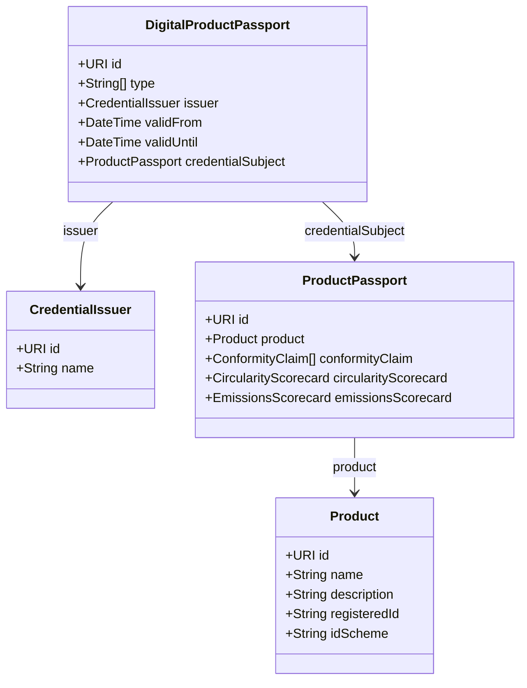

# UNTP DPP Schema

The UN Trade Facilitation and Electronic Business Centre (UN/CEFACT) has developed the United Nations Transparency Protocol (UNTP) for Digital Product Passports.

## Overview

The UNTP Digital Product Passport (DPP) is a standardized format for sharing product sustainability and circularity information across supply chains.

## Schema Version

dppvalidator currently supports UNTP DPP Schema version **0.6.1**.

## Schema Structure



## Key Components

### DigitalProductPassport

The root credential containing:

- **id** — Unique identifier (URI)
- **type** — Credential types
- **issuer** — Who issued the passport
- **validFrom** / **validUntil** — Validity period
- **credentialSubject** — The actual passport data

### CredentialSubject (ProductPassport)

Contains product-specific information:

- **product** — Product details
- **conformityClaim** — Compliance declarations
- **cirularityScorecard** — Circularity metrics
- **emissionsScorecard** — Carbon footprint data
- **traceabilityInformation** — Supply chain data

### Product

Core product information:

- **id** — Product identifier
- **name** — Product name
- **description** — Product description
- **registeredId** — Official registration ID
- **idScheme** — ID scheme (GTIN, etc.)

## JSON Schema

The schema is available at:

```text
https://vocabulary.uncefact.org/untp/dpp/0.6.1/schema.json
```

## Example

```json
{
  "@context": [
    "https://www.w3.org/ns/credentials/v2",
    "https://vocabulary.uncefact.org/untp/dpp/0.6.1"
  ],
  "type": ["DigitalProductPassport", "VerifiableCredential"],
  "id": "https://example.com/dpp/battery-001",
  "issuer": {
    "id": "https://example.com/manufacturer",
    "name": "Battery Manufacturer Inc."
  },
  "validFrom": "2024-01-01T00:00:00Z",
  "validUntil": "2029-01-01T00:00:00Z",
  "credentialSubject": {
    "id": "https://example.com/product/battery-001",
    "product": {
      "id": "https://example.com/product/battery-001",
      "name": "EV Battery Pack",
      "description": "High-capacity lithium-ion battery"
    }
  }
}
```

## Related Standards

- **W3C Verifiable Credentials** — Credential format
- **EU ESPR** — Ecodesign for Sustainable Products Regulation
- **CIRPASS** — Circular Economy Product Passport standards

## Next Steps

- [Three-Layer Validation](validation-layers.md) — How dppvalidator validates DPPs
- [Validation Guide](../guides/validation.md) — Using the validation engine
