# Three-Layer Validation

dppvalidator uses a three-layer validation architecture to ensure Digital Product Passports are structurally correct, type-safe, and semantically meaningful.

## Architecture

```mermaid
flowchart TD
    subgraph Input
        A[/"📄 Input Data (JSON)"/]
    end

    subgraph Layer1["Layer 1: Schema Validation"]
        B["JSON Schema Draft 2020-12<br/>Required fields, types, formats"]
    end

    subgraph Layer2["Layer 2: Model Validation"]
        C["Pydantic v2 Models<br/>Type coercion, URL validation"]
    end

    subgraph Layer3["Layer 3: Semantic Validation"]
        D["Business Rules & Vocabularies<br/>ISO codes, date logic, references"]
    end

    subgraph Output
        E[/"✅ ValidationResult<br/>.valid | .errors | .warnings"/]
    end

    A --> B
    B -->|"SCH001-SCH099"| C
    C -->|"MOD001-MOD099"| D
    D -->|"SEM001-SEM099"| E

    style Layer1 fill:#e3f2fd,stroke:#1976d2
    style Layer2 fill:#fff3e0,stroke:#f57c00
    style Layer3 fill:#e8f5e9,stroke:#388e3c
    style Output fill:#f3e5f5,stroke:#7b1fa2
```



## Layer 1: Schema Validation

Validates JSON structure against the UNTP DPP JSON Schema.

**What it checks:**

- Required fields are present
- Field types match schema (string, number, array, etc.)
- String formats (URI, date-time, email)
- Enum values
- Array constraints (minItems, maxItems)
- Object constraints (additionalProperties)

**Error codes:** `SCH001` - `SCH099`

## Layer 2: Model Validation

Validates data against Pydantic models with stricter type checking.

**What it checks:**

- Python type constraints
- URL validation (HttpUrl)
- Date/datetime parsing
- Custom field validators
- Model-level validators (cross-field)

**Error codes:** `MOD001` - `MOD099`

## Layer 3: Semantic Validation

Validates business rules and external vocabulary references.

**What it checks:**

- Vocabulary values (ISO country codes, UN/CEFACT unit codes)
- Date relationships (validFrom < validUntil)
- Identifier format validation
- Cross-reference consistency
- Domain-specific rules

**Error codes:** `SEM001` - `SEM099`

## Selecting Layers

```python
from dppvalidator.validators import ValidationEngine

# All layers (default)
engine = ValidationEngine()

# Schema only
engine = ValidationEngine(layers=["schema"])

# Model + Semantic (skip schema)
engine = ValidationEngine(layers=["model", "semantic"])
```

## Performance

| Layer    | Typical Time |
| -------- | ------------ |
| Schema   | ~5μs         |
| Model    | ~8μs         |
| Semantic | ~3μs         |
| **All**  | **~13μs**    |

## Next Steps

- [Validation Guide](../guides/validation.md) — Using the validation engine
- [API Reference](../reference/api/validators.md) — ValidationEngine API
