# Five-Layer Validation

dppvalidator uses a five-layer validation architecture to ensure Digital Product Passports are structurally correct, type-safe, semantically meaningful, cryptographically verifiable, and supply-chain traceable.

## Architecture

```mermaid
flowchart TD
    subgraph Input
        A[/"📄 Input Data (JSON)"/]
    end

    subgraph Layer0["Layer 0: Schema Detection"]
        A0["Auto-detect schema version<br/>from $schema, @context, type"]
    end

    subgraph Layer1["Layer 1: Schema Validation"]
        B["JSON Schema Draft 2020-12<br/>Required fields, types, formats"]
    end

    subgraph Layer2["Layer 2: Model Validation"]
        C["Pydantic v2 Models<br/>Type coercion, URL validation"]
    end

    subgraph Layer3["Layer 3: JSON-LD Semantic"]
        C2["PyLD Expansion<br/>Context resolution, term validation"]
    end

    subgraph Layer4["Layer 4: Business Logic"]
        D["Business Rules & Vocabularies<br/>ISO codes, date logic, GTIN checksums"]
    end

    subgraph Layer5["Layer 5: Cryptographic"]
        E["VC Signature Verification<br/>DID resolution, Ed25519/ECDSA"]
    end

    subgraph Output
        F[/"✅ ValidationResult<br/>.valid | .errors | .signature_valid"/]
    end

    A --> A0
    A0 --> B
    B -->|"SCH001-SCH099"| C
    C -->|"MOD001-MOD099"| C2
    C2 -->|"JLD001-JLD099"| D
    D -->|"SEM001-SEM099"| E
    E -->|"SIG001-SIG099"| F

    style Layer0 fill:#fce4ec,stroke:#c2185b
    style Layer1 fill:#e3f2fd,stroke:#1976d2
    style Layer2 fill:#fff3e0,stroke:#f57c00
    style Layer3 fill:#e0f7fa,stroke:#0097a7
    style Layer4 fill:#e8f5e9,stroke:#388e3c
    style Layer5 fill:#fff8e1,stroke:#ffa000
    style Output fill:#f3e5f5,stroke:#7b1fa2
```



## Layer 0: Schema Detection

Automatically detects the DPP schema version from the input document.

**Detection priority:**

1. `$schema` URL pattern (e.g., `untp-dpp-schema-0.6.1.json`)
1. `@context` URLs (e.g., `/untp/dpp/0.6.1/`)
1. `type` array presence → default version
1. Fallback to default (0.6.1)

```python
from dppvalidator import ValidationEngine

# Auto-detection is the default
engine = ValidationEngine()  # schema_version="auto"

# Or explicit version for deterministic behavior
engine = ValidationEngine(schema_version="0.6.1")
```

## Layer 1: Schema Validation

Validates JSON structure against the UNTP DPP JSON Schema.

**What it checks:**

- Required fields are present
- Field types match schema (string, number, array, etc.)
- String formats (URI, date-time, email)
- Enum values
- Array constraints (minItems, maxItems)
- Object constraints (additionalProperties)

**Error codes:** `SCH001` - `SCH099`

## Layer 2: Model Validation

Validates data against Pydantic models with stricter type checking.

**What it checks:**

- Python type constraints
- URL validation (HttpUrl)
- Date/datetime parsing
- Custom field validators
- Model-level validators (cross-field)

**Error codes:** `MOD001` - `MOD099`

## Layer 3: JSON-LD Semantic Validation

Validates JSON-LD semantics using PyLD expansion algorithm.

**What it checks:**

- `@context` is present and valid
- All terms resolve during expansion (no undefined terms)
- Custom terms use proper namespacing
- Context URLs are reachable

**Error codes:** `JLD001` - `JLD099`

```python
from dppvalidator import ValidationEngine

# Enable JSON-LD validation
engine = ValidationEngine(validate_jsonld=True)

# Or via layers
engine = ValidationEngine(layers=["schema", "model", "jsonld"])
```

## Layer 4: Business Logic Validation

Validates business rules and external vocabulary references.

**What it checks:**

- Vocabulary values (ISO country codes, UN/CEFACT unit codes)
- Material codes (UNECE Rec 46)
- HS codes for product classification
- GTIN checksums (GS1 standard)
- Date relationships (validFrom < validUntil)
- Cross-reference consistency

**Error codes:** `SEM001` - `SEM099`, `VOC001` - `VOC099`

## Layer 5: Cryptographic Verification

Verifies Verifiable Credential signatures and DID resolution.

**What it checks:**

- DID resolution (`did:web`, `did:key`)
- Signature verification (Ed25519, ES256, ES384)
- Proof types (Ed25519Signature2020, DataIntegrityProof, JsonWebSignature2020)

**Error codes:** `SIG001` - `SIG099`

```python
from dppvalidator import ValidationEngine

# Enable signature verification
engine = ValidationEngine(verify_signatures=True)
result = engine.validate(dpp_data)

# Check verification status
if result.signature_valid:
    print(f"Signed by: {result.issuer_did}")
```

## Deep Validation

For supply chain traceability, use async deep validation to crawl linked documents.

```python
from dppvalidator import ValidationEngine

engine = ValidationEngine()

# Validate with supply chain traversal
result = await engine.validate_deep(
    dpp_data,
    max_depth=3,
    follow_links=["credentialSubject.traceabilityEvents"],
    timeout=30.0,
)

print(f"Total documents: {result.total_documents}")
print(f"All valid: {result.valid}")
```

## Selecting Layers

```python
from dppvalidator import ValidationEngine

# All layers (default)
engine = ValidationEngine()

# Schema only
engine = ValidationEngine(layers=["schema"])

# Model + Semantic (skip schema)
engine = ValidationEngine(layers=["model", "semantic"])

# Full validation with JSON-LD and signatures
engine = ValidationEngine(
    validate_jsonld=True,
    verify_signatures=True,
)
```

## Performance

Benchmark results (1000 iterations, Apple Silicon):

| Layer            | Mean Time | Throughput      |
| ---------------- | --------- | --------------- |
| Model (minimal)  | 0.011ms   | 86,988 ops/sec  |
| Model (full)     | 0.016ms   | 61,848 ops/sec  |
| Semantic         | 0.005ms   | 193,628 ops/sec |
| Full (Model+Sem) | 0.017ms   | 58,177 ops/sec  |
| Engine Creation  | 3.867ms   | 259 ops/sec     |

Run benchmarks: `uv run python -m benchmarks.run_benchmarks --all`

*JSON-LD and signature verification depend on network latency (cached after first request).*

## Next Steps

- [Validation Guide](../guides/validation.md) — Using the validation engine
- [API Reference](../reference/api/validators.md) — ValidationEngine API
