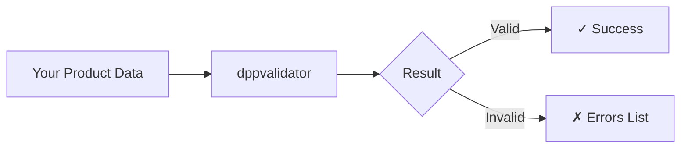

# Introduction

## What is a Digital Product Passport?

A **Digital Product Passport (DPP)** is like a digital ID card for physical
products. Just as you have an ID that contains your personal information, a DPP
contains essential information about a product throughout its entire
lifecycle—from manufacturing to recycling.

Starting in 2027, the European Union will require DPPs for many product
categories (batteries, textiles, electronics, etc.) as part of the **Ecodesign
for Sustainable Products Regulation (ESPR)**. These passports help consumers,
businesses, and regulators understand:

- **What** is the product made of?
- **Where** did it come from?
- **How** can it be repaired, recycled, or disposed of?
- **Who** manufactured it and under what conditions?

## What is dppvalidator?

**dppvalidator** is a Python library that checks whether your Digital Product
Passport data is correctly formatted and complete. Think of it as a
spell-checker, but for product data instead of text.

### What dppvalidator does

- ✅ **Validates structure** — Checks that your DPP data follows the correct
  format
- ✅ **Checks required fields** — Ensures all mandatory information is present
- ✅ **Verifies data types** — Confirms that numbers are numbers, dates are
  dates, etc.
- ✅ **Validates against standards** — Checks compliance with EU/UNECE
  standards
- ✅ **Provides clear error messages** — Tells you exactly what's wrong and
  where
- ✅ **Exports to standard formats** — Converts your data to JSON-LD for
  interoperability

### What dppvalidator does NOT do

- ❌ **Create DPP content for you** — You still need to gather and enter your
  product data
- ❌ **Verify factual accuracy** — It can't tell if your product really weighs
  5kg; it only checks that you provided a valid weight value
- ❌ **Connect to government systems** — It's a validation tool, not a
  submission portal
- ❌ **Store your data** — It processes data in memory and doesn't maintain a
  database
- ❌ **Provide legal advice** — Always consult legal experts for regulatory
  compliance

## Who is this for?

| You are...               | dppvalidator helps you...                       |
| ------------------------ | ----------------------------------------------- |
| **A developer**          | Integrate DPP validation into your applications |
| **A data engineer**      | Ensure data quality before submission           |
| **A product manager**    | Verify that your DPP data is complete           |
| **A compliance officer** | Check data against regulatory requirements      |

## How does it work?

1. You provide product passport data (as JSON)
1. dppvalidator checks it against official schemas and rules
1. You get a clear report: either "valid" or a list of specific issues to fix

## Real-World Analogy

Imagine you're filling out a tax form:

- **dppvalidator** is like tax software that highlights empty required fields,
  flags when you've entered text where a number should be, and warns if you
  forgot to sign
- It **won't** fill in the numbers for you or guarantee the IRS will accept
  your return
- It **will** catch obvious mistakes before you submit

## Next Steps

Ready to get started?

1. [Install dppvalidator](installation.md)
1. [Follow the Quick Start tutorial](quickstart.md)
